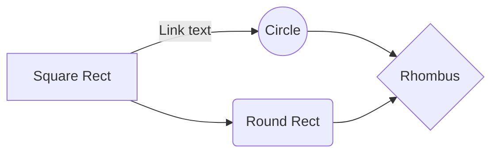

# Research-Flowcharts-Pseudocode
HW 
links in markdown

 

format [text](link)
* example of hyperlinks are [this link](www.stackoverflow.com), [another](www.google.com)

 


flowcharts

 

And this will produce a flow chart:

 



 


or this

 

###FlowChart

 

```flow
st=>start: Login
op=>operation: Login operation
cond=>condition: Successful Yes or No?
e=>end: To admin

 

st->op->cond
cond(yes)->e
cond(no)->op
```
